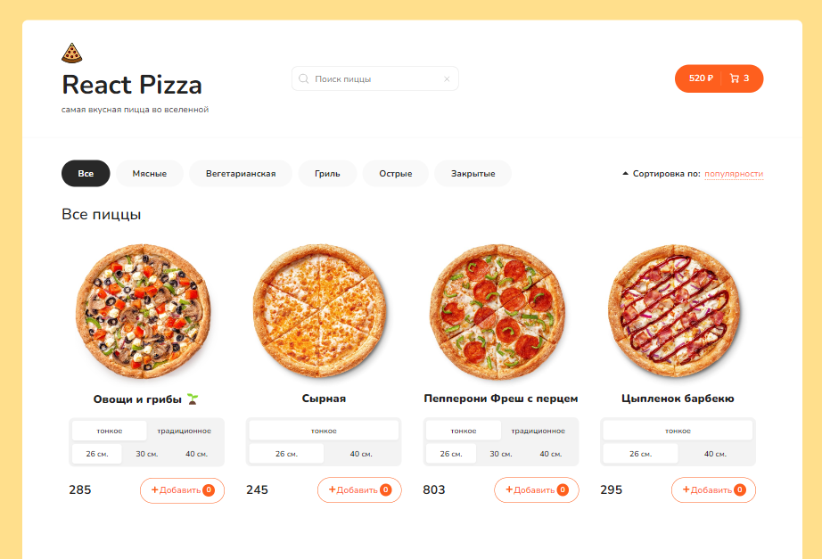

# React Pizza

### Description:

    React Pizza is a dynamic web application developed using React, showcasing the power of React hooks for state management.
    This project focuses on creating an interactive and user-friendly pizza ordering experience.

### Key Features:

    * Responsive Design: The application ensures a seamless experience across various devices, offering a responsive layout for optimal user interaction.

    * Dynamic Pizza Selection: Users can customize their pizza orders by selecting different toppings, crust types, and sizes, providing a personalized and enjoyable ordering process.

    * State-of-the-Art React Hooks: Leveraging the latest advancements in React, the project utilizes hooks such as useState and useEffect for efficient state management, ensuring a smooth and reactive user interface.

    * Real-time Updates: As users modify their pizza selections, the application dynamically updates the total price and order summary, offering a real-time preview of the customized pizza.

    * Intuitive User Interface: The user interface is designed to be intuitive and easy to navigate, allowing users to effortlessly explore the available pizza options and customize their orders with minimal effort.

    * Order Management: Completed orders are efficiently managed and displayed, providing users with a clear overview of their selections before finalizing the purchase.

### Technologies Used:

    * React
    * React Hooks (useState, useEffect)
    * HTML5 and CSS3 for markup and styling
    * Responsive design for cross-device compatibility

### How to Run the Project:

    Clone the repository from GitHub.
    Navigate to the project directory.
    Run npm install to install dependencies.
    Execute npm start to launch the application locally.
    Open your browser and visit the specified address to experience React Pizza.

### App screenshot:

